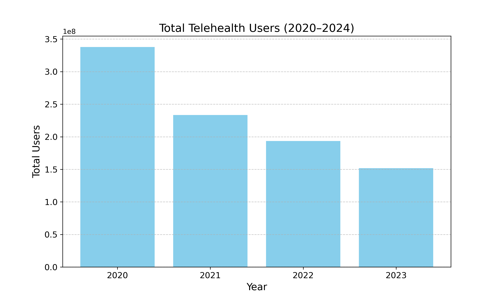
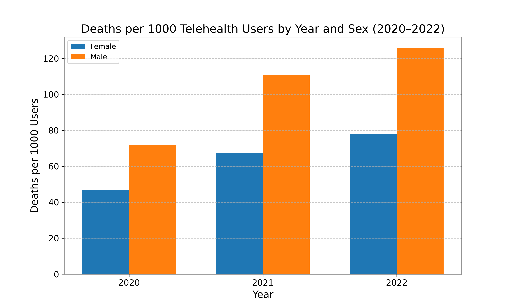
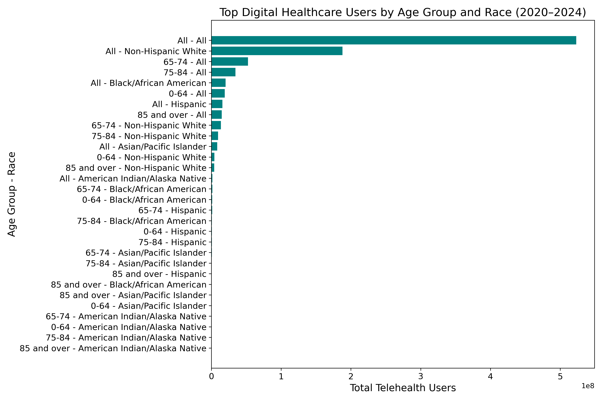

# 🩺 CPSC368 – Digital Healthcare Analysis in the United States (2020–2024)

This project explores the **adoption** and **impact** of digital healthcare services (telehealth) in the United States from **2020 to 2024**. Using public datasets and SQL queries on a local SQLite database, we analyze trends in telehealth usage, demographic patterns, and potential relationships with health outcomes like hospital mortality.

---

## ❓ Research Questions

- **RQ1:** Has the adoption of digital healthcare in the United States increased from 2020 to 2024?  
- **RQ2:** Did the use of digital healthcare services have an impact on the number of hospital deaths from 2020 to 2022? *(Coming soon)*  
- **RQ3:** Which demographic groups used digital healthcare the most between 2020 and 2024 (based on age and race)?

---

## 🗂️ Project Structure

| File/Folder            | Description                                                                 |
|------------------------|-----------------------------------------------------------------------------|
| `create_tables.sql`    | SQL script to create tables from CSV files                                  |
| `insert_sql.py`        | Python script to insert and process CSV data into SQLite database           |
| `RQ1.py`               | SQL + analysis for RQ1 (adoption trend: 2020–2024)                          |
| `RQ2.py`               | SQL + analysis for RQ2 (mortality impact of telehealth)                    |
| `RQ3.py`               | SQL + analysis for RQ3 (demographic usage by age & race)                   |
| `data/`                | Folder containing raw datasets (`mortality.csv`, `telehealth.csv`)         |
| `data/processed_data/` | Processed outputs used in answering RQs                                     |
| `notebooks/`           | Jupyter notebooks for exploratory data analysis                             |
| `pics/`                | Generated visualizations and graphs from the analysis                       |
| `my_database.db`       | SQLite database built from telehealth and mortality datasets                |
| `README.md`            | Project documentation and usage guide                                       |
| `LICENSE`              | MIT License                                                                 |

---

## 🧪 Datasets

This project uses two public datasets:

- **Mortality Data:** Contains year, sex, age group, and number of deaths.
- **Telehealth Data:** Contains demographic details (age, sex, race) and counts of users accessing telehealth services.

---

## 📄 Dataset Schema

### `telehealth.csv` → `telehealth` table

| Column                              | Type     | Description                                                |
|-------------------------------------|----------|------------------------------------------------------------|
| `ID`                                | NUMBER   | Unique identifier for each record                          |
| `Year`                              | NUMBER   | Year of observation (2020–2024)                            |
| `Age_Group`                         | VARCHAR  | Age category (e.g., 0–64, 65–74, 75–84, 85+)               |
| `State`                             | VARCHAR  | U.S. state abbreviation                                    |
| `Medicare_Medicaid_Status`          | VARCHAR  | Medicare/Medicaid eligibility category                     |
| `Race`                              | VARCHAR  | Race/Ethnicity group                                       |
| `Sex`                               | VARCHAR  | Sex (Male, Female)                                         |
| `Medicare_Enrollment_Status`        | VARCHAR  | Medicare enrollment type/status                            |
| `Age_Grouping`                      | VARCHAR  | Age category (e.g., 0–64, 65–74, 75–84, 85+)               |
| `Urban_Rural_Description`           | VARCHAR  | Urban or rural classification                              |
| `Total_Eligible_Users`              | NUMBER   | Total people eligible for digital health                   |
| `Total_Medicare_Enrollment`         | NUMBER   | Total Medicare enrollees                                   |
| `Total_Telehealth_Users`            | NUMBER   | Number of people who used telehealth services              |
| `Percentage_of_Medicare_Telehealth_Users` | NUMBER | Percent of Medicare enrollees who used telehealth      |

### `mortality.csv` → `mortality` table

| Column      | Type     | Description                            |
|-------------|----------|----------------------------------------|
| `ID`        | NUMBER   | Unique identifier for each record      |
| `Year`      | NUMBER   | Year of death report                   |
| `Sex`       | VARCHAR  | Sex (Male, Female)                     |
| `Age`       | NUMBER   | Age in years                           |
| `Deaths`    | NUMBER   | Number of recorded deaths              |
| `Age_Group` | VARCHAR  | Age category (e.g., 0–64, 65–74, etc.) |

---

## 📊 Sample Visualizations

Below are a few sample plots generated from the analysis:





---

## ⚙️ Requirements

Ensure the following Python packages are installed:

```bash
pip install pandas sqlite3 matplotlib
